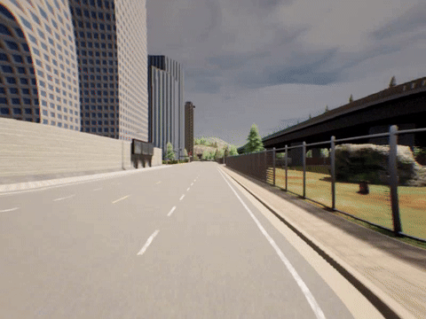
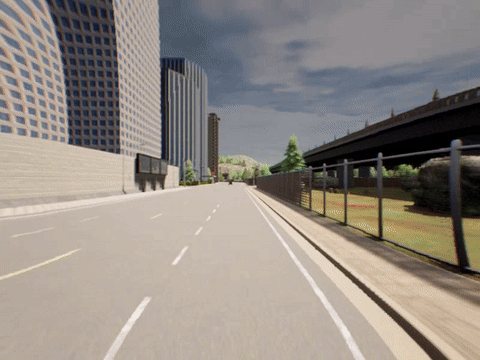

# Correcting Autonomous Vehicle Behavior to Ensure Rule Compliance

*Accepted at ICRA 2026*

[Paper (coming soon)] | [Jupyter Notebook](results.ipynb) | License: MIT

**Authors:** Felipe Toledo, Trey Woodlief, Sebastian Elbaum, and Matthew B. Dwyer  
*University of Virginia* — *William & Mary*

---

<p align="center">
  
  &nbsp;&nbsp;
  
</p>
<p align="center">
  <sub><b>Left:</b> Interfuser Baseline running a red light &nbsp;|&nbsp; <b>Right:</b> Interfuser + M4PC (GT) stopping at red light</sub>
</p>

---

## Abstract

M4PC is a method to correct autonomous vehicle behavior at runtime to ensure compliance with traffic rules. We evaluate on CARLA with three state-of-the-art AV stacks: TCP, InterFuser, and Pylot. Results show consistent improvements in driving score and reductions in infractions such as collisions, red-light violations, and stop-sign violations.

## Results

All metrics are reported as mean ± std. Higher driving score is better; lower values are better for all infraction metrics.

### TCP

| Treatment | Driving Score | Coll. Ped. | Coll. Veh. | Red Light | Route Timeout | Stop Sign | Veh. Blocked |
|-----------|---------------|------------|------------|-----------|---------------|-----------|---------------|
| Baseline | 76.86 ± 23.43 | 0.00 ± 0.00 | 0.10 ± 0.36 | 0.06 ± 0.24 | 0.00 ± 0.00 | 1.10 ± 1.23 | 0.00 ± 0.00 |
| T4PC | 78.23 ± 21.76 | 0.00 ± 0.00 | 0.12 ± 0.33 | **0.00 ± 0.00** | 0.00 ± 0.00 | 0.94 ± 1.13 | 0.02 ± 0.14 |
| M4PC (SGG) | 79.99 ± 27.97 | 0.00 ± 0.00 | 0.22 ± 0.55 | 0.06 ± 0.31 | 0.00 ± 0.00 | **0.20 ± 0.40** | 0.08 ± 0.27 |
| **M4PC (GT)** | **87.16 ± 24.76** | 0.00 ± 0.00 | **0.04 ± 0.20** | 0.06 ± 0.24 | 0.00 ± 0.00 | 0.12 ± 0.33 | 0.08 ± 0.27 |

### InterFuser

| Treatment | Driving Score | Coll. Ped. | Coll. Veh. | Red Light | Route Timeout | Stop Sign | Veh. Blocked |
|-----------|---------------|------------|------------|-----------|---------------|-----------|---------------|
| Baseline | 59.41 ± 32.28 | 0.26 ± 0.49 | 0.64 ± 0.88 | 0.42 ± 0.67 | 0.06 ± 0.24 | 0.00 ± 0.00 | **0.00 ± 0.00** |
| T4PC | 64.05 ± 35.47 | 0.18 ± 0.39 | 0.72 ± 1.07 | 0.28 ± 0.50 | 0.18 ± 0.39 | 0.00 ± 0.00 | **0.00 ± 0.00** |
| M4PC (SGG) | 60.14 ± 32.37 | 0.12 ± 0.39 | 0.54 ± 0.79 | 0.42 ± 0.64 | 0.04 ± 0.20 | 0.00 ± 0.00 | 0.12 ± 0.33 |
| **M4PC (GT)** | **69.74 ± 32.42** | **0.10 ± 0.36** | **0.34 ± 0.59** | **0.04 ± 0.20** | **0.02 ± 0.14** | 0.00 ± 0.00 | 0.26 ± 0.44 |

### Pylot

| Treatment | Driving Score | Coll. Ped. | Coll. Veh. | Red Light | Route Timeout | Stop Sign | Veh. Blocked |
|-----------|---------------|------------|------------|-----------|---------------|-----------|---------------|
| Baseline | 68.96 ± 26.70 | 0.00 ± 0.00 | 0.32 ± 0.65 | 0.54 ± 0.86 | **0.00 ± 0.00** | 0.44 ± 0.54 | 0.02 ± 0.14 |
| M4PC (SGG) | 75.38 ± 27.05 | 0.00 ± 0.00 | 0.24 ± 0.48 | 0.52 ± 0.99 | 0.04 ± 0.20 | **0.24 ± 0.43** | 0.00 ± 0.00 |
| **M4PC (GT)** | **80.53 ± 24.03** | 0.00 ± 0.00 | **0.20 ± 0.45** | **0.38 ± 0.64** | 0.12 ± 0.33 | 0.00 ± 0.00 | 0.00 ± 0.00 |

## Reproducing Results

The analysis in this repository uses the raw experiment results stored in `exp_results/`. Each benchmark (TCP, InterFuser, Pylot) contains JSON result files for multiple approaches (Baseline/original, M4PC with GT, M4PC with SGG, and T4PC where applicable).

To reproduce the tables above, run `results.ipynb`. The notebook loads the JSON results, computes mean and standard deviation per approach, and produces the summary tables.

## Citation

```bibtex
@inproceedings{m4pc-icra2026,
  title     = {Correcting Autonomous Vehicle Behavior to Ensure Rule Compliance},
  author    = {Felipe Toledo and Trey Woodlief and Sebastian Elbaum and Matthew B. Dwyer},
  booktitle = {ICRA},
  year      = {2026}
}
```

## License

MIT License. See [LICENSE](LICENSE) for details.
